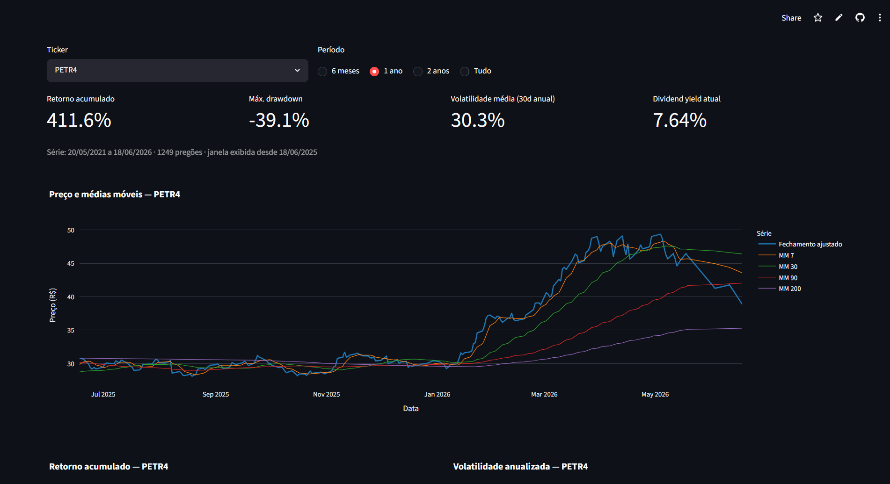
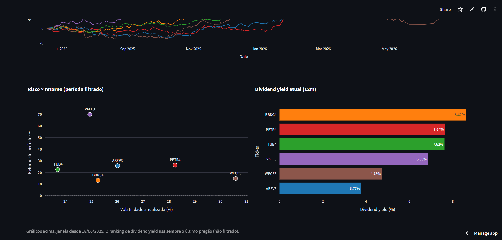
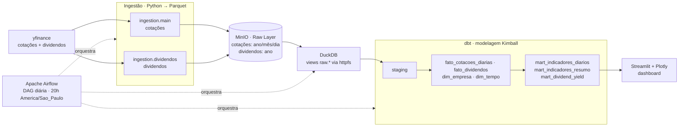
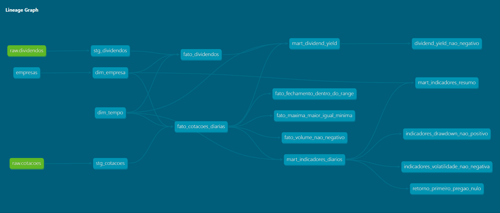
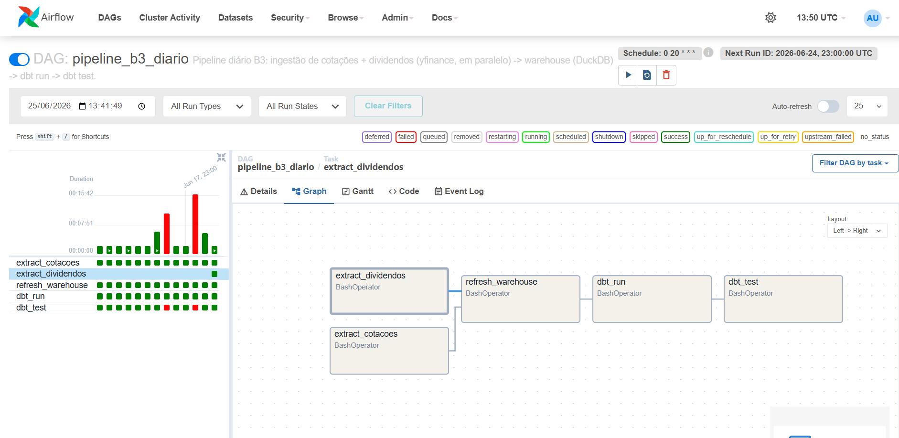

# b3-data-pipeline

Pipeline de dados de mercado da B3, ponta a ponta: **ingestão → object storage → warehouse → transformação (dbt) → orquestração (Airflow) → dashboard**. Projeto de portfólio para engenharia de dados, rodando 100% local.

[](https://github.com/pedropaulo-d/b3-data-pipeline/actions/workflows/security.yml)

---

## 🔗 Dashboard ao vivo

**<https://b3-data-pipeline-jzsx7mgpas7obxzseykg8g.streamlit.app/>**

Publicado no Streamlit Community Cloud. **Nota honesta:** o app lê um **snapshot** dos marts versionado no repo (`warehouse.duckdb`), **não dados ao vivo** — a atualização do snapshot é manual e deliberada (ver [`dashboard/README.md`](dashboard/README.md)).

| Visão Individual (Aba 1) | Comparação (Aba 2) |
|--------------------------|--------------------|
|  |  |
| Preço com médias móveis e indicadores de um ticker. | Risco × retorno recalculado na janela, para os 6 tickers. |

---

## Arquitetura



Camadas seguindo arquitetura medalhão: **raw** (imutável, fiel à fonte) → **staging** (limpeza/tipagem) → **marts** (modelos analíticos). O raw mora exclusivamente no MinIO; o DuckDB o expõe via views `httpfs` sem materializar.

---

## Escopo

Seis tickers líquidos cobrindo quatro setores, com histórico de **5 anos** — suficiente para exercitar particionamento, modelagem e indicadores sem inflar o volume.

| Ticker | Empresa       | Setor               |
|--------|---------------|---------------------|
| PETR4  | Petrobras     | Petróleo e Gás      |
| VALE3  | Vale          | Mineração           |
| ITUB4  | Itaú Unibanco | Financeiro          |
| BBDC4  | Bradesco      | Financeiro          |
| WEGE3  | WEG           | Bens Industriais    |
| ABEV3  | Ambev         | Consumo Não-Cíclico |

A lista de tickers e a janela histórica são parâmetros, não constantes do código — escalar para o Ibovespa inteiro é mudar uma lista.

---

## Stack

| Camada | Tecnologia | Papel |
|--------|-----------|-------|
| Linguagem | **Python 3.11+** (pip + venv) | Ingestão e utilitários. |
| Ingestão | **yfinance, pandas, pyarrow** | Baixa cotações e dividendos; grava Parquet. |
| Object storage | **MinIO** (compatível S3, via boto3) | Raw layer em Parquet particionado. |
| Warehouse | **DuckDB** | Engine analítico embarcado; lê o Parquet do MinIO via `httpfs`. |
| Transformação | **dbt** (adapter `dbt-duckdb`) | Modelagem Kimball, testes, lineage. |
| Orquestração | **Apache Airflow 2.10** (Docker, LocalExecutor) | DAG diária; ingestões em paralelo. |
| Visualização | **Streamlit + Plotly** | Dashboard read-only sobre os marts. |
| CI | **GitHub Actions** (`pip-audit` + `gitleaks`) | Auditoria de CVEs e varredura de secrets. |

Ambiente local, single-host, sem cloud.

---

## Componentes do pipeline

### Ingestão (`ingestion/`)
Dois alvos no yfinance: cotações (OHLC + volume + fechamento ajustado, partição por **dia**) e dividendos (proventos, partição por **ano** — esparsos). Ambos gravam Parquet no MinIO via um cliente boto3 compartilhado (`ingestion/s3_client.py`). Raw é append-only e idempotente: reexecutar sobrescreve a partição, sem duplicar.

### Warehouse (`warehouse/`)
`warehouse.setup` cria o schema `raw` no DuckDB com duas views (`raw.cotacoes`, `raw.dividendos`) que apontam para o MinIO via `httpfs`. Como são views, novas partições aparecem sem refresh e o raw segue imutável no object storage.

### Transformação — dbt (`dbt/`)
Modelagem dimensional Kimball. `staging` (views, limpeza 1:1 com o raw) alimenta as fatos e dimensões; os marts da Etapa 6 calculam indicadores (retorno simples/log/acumulado, médias móveis 7/30/90/200, volatilidade anualizada, drawdown) e dividend yield trailing 12 meses. Dimensões conformadas (`dim_empresa`, `dim_tempo`) são reusadas por cotações e dividendos.



### Orquestração — Airflow (`airflow/`)
DAG `pipeline_b3_diario`: 5 `BashOperator` que rodam os mesmos comandos do terminal manual. As duas ingestões (`extract_cotacoes`, `extract_dividendos`) rodam **em paralelo**; `refresh_warehouse` é o ponto de fan-in (espera as duas), seguido de `dbt run` e `dbt test`. Schedule `0 20 * * *` em `America/Sao_Paulo`, `catchup=False`, `retries=2`.



### Dashboard — Streamlit (`dashboard/`)
Lê **somente** os marts, em `read_only` (sem tocar no MinIO), o que permite leitura concorrente enquanto a DAG escreve. Duas abas: Visão Individual (um ticker: cartões, preço com médias móveis, 5 gráficos Plotly) e Comparação (6 tickers: retorno re-ancorado na janela, risco × retorno, ranking de DY).

---

## Estrutura do repositório

```
b3-data-pipeline/
├── ingestion/          # Download e persistência no MinIO (cotações + dividendos/)
├── warehouse/          # Conexão e setup do DuckDB; views raw.* via httpfs
├── dbt/                # Projeto dbt: staging, fatos/dims, marts, testes, seed
├── airflow/            # Imagem custom, DAG pipeline_b3_diario, Dockerfile
├── dashboard/          # App Streamlit + Plotly (read-only sobre os marts)
├── sql/exploratoria/   # Queries .sql versionadas (executadas pelo notebook)
├── scripts/            # Utilitários de validação e operação (não-pipeline)
├── notebooks/          # Exploração ad-hoc em Jupyter
├── data/raw/           # Histórico da Etapa 1 (raw atual mora no MinIO)
├── docs/               # decisoes.md · divida_tecnica.md · NOTAS.md · img/
├── docker-compose.yml  # MinIO + Airflow (Postgres, webserver, scheduler)
├── requirements*.txt   # runtime · dev · dashboard (papéis distintos)
└── .env.example        # Template de credenciais (o .env real é gitignored)
```

Cada pasta apareceu na etapa que a exigiu — o repositório evolui em camadas.

---

## Como rodar

Pré-requisitos: **Python 3.11+**, **Docker** e **Docker Compose**.

```bash
# 1. Clonar e criar o ambiente
git clone https://github.com/pedropaulo-d/b3-data-pipeline.git
cd b3-data-pipeline
python -m venv .venv
source .venv/bin/activate          # Windows: .venv\Scripts\Activate.ps1
pip install -r requirements.txt    # runtime do pipeline (ingestão, warehouse, dbt)

# 2. Credenciais do MinIO (defaults locais já funcionam)
cp .env.example .env               # Windows: copy .env.example .env

# 3. Subir MinIO + Airflow (Postgres, scheduler, webserver)
docker compose build               # 1ª vez ou após mudar requirements.txt / Dockerfile
docker compose up -d               # ~1-2 min na 1ª subida; confira com: docker compose ps
#   Console MinIO  → http://localhost:9001   |   Airflow UI → http://localhost:8080 (admin/admin)

# 4. Carga inicial (manual, fora da DAG)
python -m ingestion.main --modo inicial             # cotações
python -m ingestion.dividendos.main --modo inicial  # dividendos
python -m warehouse.setup                           # cria schema raw + views no DuckDB

# 5. Transformar e testar (dbt)
cd dbt
dbt deps --profiles-dir ./
dbt build --profiles-dir ./        # seed + run + test (49 testes) em um comando
```

**Automação:** em vez dos passos 4–5, despause a DAG `pipeline_b3_diario` na UI do Airflow e clique em *Trigger DAG* — as 5 tasks rodam a ingestão, o refresh do warehouse, o `dbt run` e o `dbt test`. Detalhes em [`airflow/README.md`](airflow/README.md).

**Dashboard local:** com os marts já materializados,

```bash
pip install -r requirements-dashboard.txt
streamlit run dashboard/app.py     # http://localhost:8501
```

Derrubar os serviços: `docker compose down` (mantém os volumes) ou `docker compose down -v` (apaga raw + metastore).

---

## Decisões técnicas

O detalhe completo, com contexto e trade-off de cada escolha, está em [`docs/decisoes.md`](docs/decisoes.md) (45 decisões registradas). As de maior peso:

1. **Local em vez de cloud** — MinIO (S3-compatível) + DuckDB dão custo zero e portabilidade; abro mão de exercitar IAM real.
2. **Esquema estrela Kimball com dimensões conformadas** — `dim_empresa` e `dim_tempo` são reusadas pela fato de cotações e pela de dividendos.
3. **Preço ajustado para retorno/risco, bruto para dividend yield** — o ajustado evita queda artificial na data-ex; o bruto no denominador do DY evita contar o provento duas vezes.
4. **Idempotência semântica no raw** — reexecutar sobrescreve a partição; rodar duas vezes não duplica nem corrompe estado.
5. **Particionamento por densidade** — cotações por dia, dividendos por ano (proventos são esparsos), evitando micro-arquivos.
6. **Raw como views DuckDB sobre o MinIO (`httpfs`)** — janela lógica sobre o object storage; novas partições aparecem sem refresh e o raw permanece imutável.
7. **Ingestões em paralelo na DAG, com fan-in** — `refresh_warehouse` só roda após as duas ingestões; aproveita o paralelismo do LocalExecutor.
8. **Separação runtime / dev de dependências** — o CI audita só o `requirements.txt` (superfície de produção), sem falhar por CVEs de transitivas do Jupyter.
9. **`profiles.yml` do dbt versionado, credenciais via `env_var()`** — clonar e rodar sem etapa "configure seu profile".
10. **Dashboard read-only sobre snapshot** — abre o DuckDB em `read_only=True`, permitindo leitura enquanto a DAG escreve.

---

## Qualidade e CI

- **49 testes dbt** — nativos (`not_null`, `unique`, `relationships`, `accepted_values`), `dbt_utils` e **7 testes custom** que codificam regras de negócio (ex.: coerência OHLC, volume não-negativo, dividend yield não-negativo).
- **CI de segurança** ([`.github/workflows/security.yml`](.github/workflows/security.yml)) em todo push para `main` e em todo PR:
  - **`pip-audit`** sobre o `requirements.txt` — falha o build em qualquer CVE conhecido no runtime.
  - **`gitleaks`** sobre o histórico completo do Git — falha o build se encontrar secret vazado.

Reproduzir o audit localmente: `pip install pip-audit && pip-audit -r requirements.txt`.

---

## Status e roadmap

Etapas 0–7 concluídas (ingestão → object storage → warehouse → dbt → Airflow → indicadores → dashboard). A **Etapa 8** (polimento e portfólio) está em andamento.

A dívida técnica é registrada conscientemente em [`docs/divida_tecnica.md`](docs/divida_tecnica.md) — ex.: o snapshot `warehouse.duckdb` versionado infla o histórico do Git (plano B em Parquet/LFS documentado), e o retry da DAG ainda não foi exercitado sob falha real. O caderno de aprendizados por etapa fica em [`docs/NOTAS.md`](docs/NOTAS.md).
